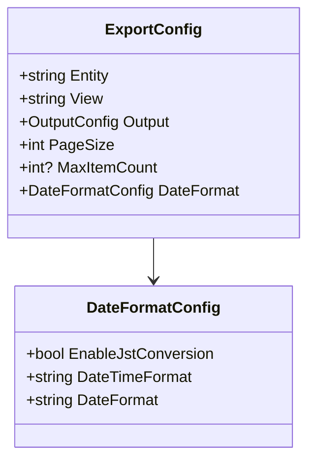

# 日時フォーマット改善実装計画

## 概要

- UTC→JST 変換機能の実装
- 日付形式の改善
  - datetime 型: YYYY/MM/DD HH:mm:ss
  - date 型: YYYY/MM/DD

## 1. 設定ファイルの拡張



### 設定ファイル例

```json
{
  "export": {
    "dateFormat": {
      "enableJstConversion": true,
      "dateTimeFormat": "yyyy/MM/dd HH:mm:ss",
      "dateFormat": "yyyy/MM/dd"
    }
  }
}
```

## 2. コード変更

### DateFormatter クラスの新規作成

```csharp
public class DateFormatter
{
    private readonly DateFormatConfig _config;
    private static readonly TimeSpan JstOffset = TimeSpan.FromHours(9);

    public DateFormatter(DateFormatConfig config)
    {
        _config = config;
    }

    public string FormatDateTime(DateTime utcDateTime, bool isDateOnly)
    {
        if (_config.EnableJstConversion)
        {
            utcDateTime = utcDateTime.Add(JstOffset);
        }

        return utcDateTime.ToString(
            isDateOnly ? _config.DateFormat : _config.DateTimeFormat
        );
    }
}
```

### CsvExporter の修正

```csharp
private readonly DateFormatter _dateFormatter;

private string FormatAttributeValue(object value, string attributeName)
{
    // Dataverseのメタデータを使用して属性の型を判定
    bool isDateOnly = IsDateOnlyAttribute(attributeName);

    return value switch
    {
        DateTime dateTime => _dateFormatter.FormatDateTime(dateTime, isDateOnly),
        // その他の型の処理...
        _ => value?.ToString() ?? string.Empty
    };
}
```

## 3. テスト計画

1. 日時変換のテスト

   - UTC→JST の変換が正しく行われることを確認
   - 日付の境界値（日付が変わる時刻など）のテスト

2. フォーマットのテスト

   - datetime 型の値が YYYY/MM/DD HH:mm:ss 形式で出力されることを確認
   - date 型の値が YYYY/MM/DD 形式で出力されることを確認
   - NULL 値のハンドリングを確認

3. Dataverse 属性タイプの判定テスト
   - 属性タイプの判定が正しく行われることを確認

## 4. 実装手順

1. モデルの更新

   - `DateFormatConfig`クラスの実装
   - 設定ファイルのスキーマ更新

2. コア機能の実装

   - `DateFormatter`クラスの作成
   - 属性タイプ判定機能の実装

3. CsvExporter の更新

   - `FormatAttributeValue`メソッドの改善
   - Dataverse 属性タイプの判定処理の追加

4. テストの実装と実行

5. ドキュメントの更新
   - README.md の更新
   - 設定ファイルのドキュメント更新
