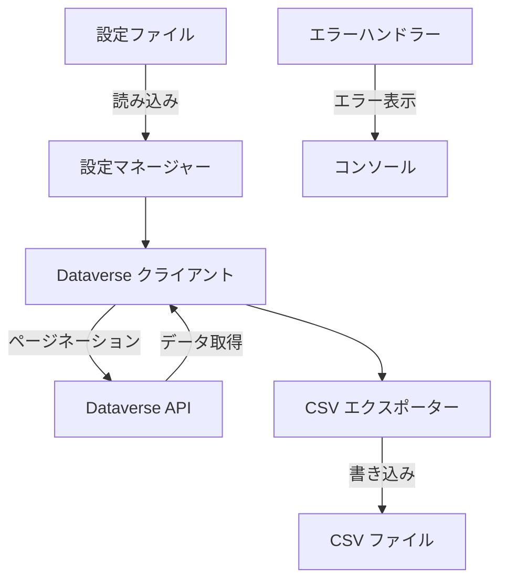
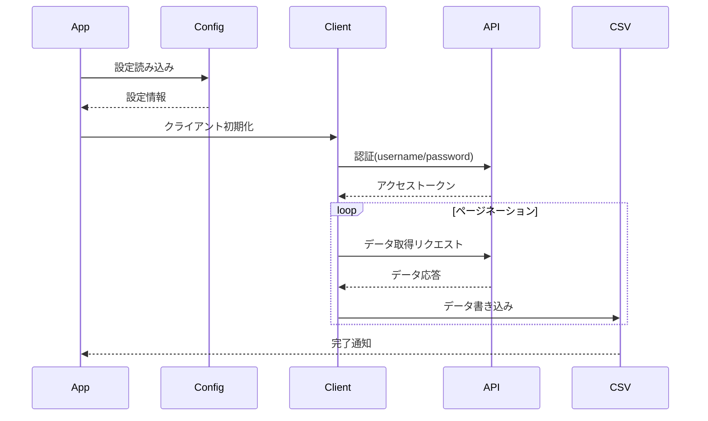
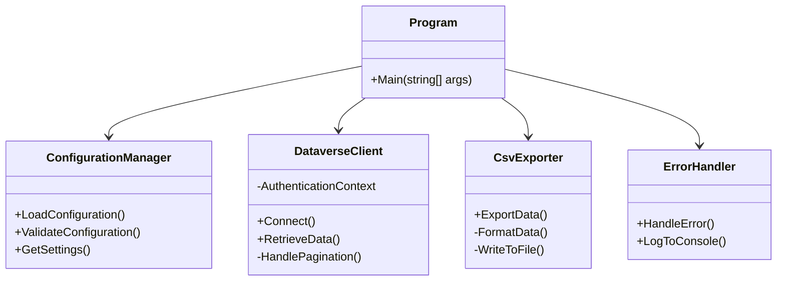

# Dataverse CSV Exporter 設計書

## システム概要

Dynamics 365 Sales の Dataverse からエンティティ名とビュー名を指定してデータを CSV にエクスポートするコンソールアプリケーション。

## システム構成図



## 処理フロー図



## クラス構造



## 主要コンポーネント

### 1. 設定管理（ConfigurationManager）

- JSON 設定ファイルの読み込み・検証
- 接続情報、エンティティ名、ビュー名、出力設定の管理

### 2. Dataverse クライアント（DataverseClient）

- Dataverse API 通信処理
- 5000 件ごとのページネーション処理
- FetchXML クエリの構築

### 3. CSV エクスポーター（CsvExporter）

- データの CSV 形式への変換・出力
- 大容量データの効率的な書き込み

### 4. エラーハンドラー（ErrorHandler）

- エラーメッセージのコンソール出力
- 例外処理の一元管理

## 設定ファイル仕様

設定ファイル（config.json）の構造：

```json
{
  "dataverse": {
    "url": "https://your-org.crm.dynamics.com",
    "username": "your-username",
    "password": "your-password"
  },
  "export": {
    "entity": "account",
    "view": "active-accounts",
    "output": {
      "directory": "./output",
      "fileName": "{entity}_{timestamp}.csv"
    },
    "pageSize": 5000
  }
}
```

## 処理フロー

1. 設定ファイルの読み込みと検証
2. Dataverse API への接続（username/password 認証）
3. 指定されたビューの FetchXML の取得
4. ページネーションによるデータ取得
5. CSV ファイルへのデータ出力
6. エラー発生時のコンソール出力

## 技術仕様

### 開発環境

- .NET Core コンソールアプリケーション
- C#言語

### 主要な依存パッケージ

- Microsoft.PowerPlatform.Dataverse.Client
- CsvHelper
- Microsoft.Extensions.Configuration.Json

### エラーハンドリング

- 例外発生時はコンソールに適切なメッセージを表示
- リトライ処理は実装しない

### 大容量データ対応

- 5000 レコードごとのページネーション処理
- ストリーミング処理によるメモリ効率の最適化
