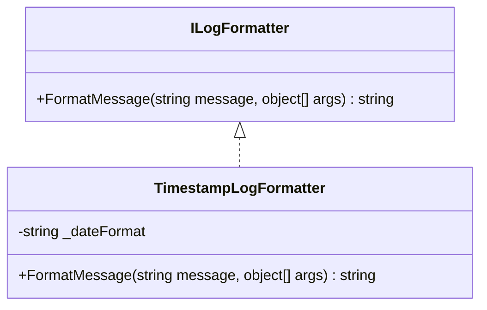
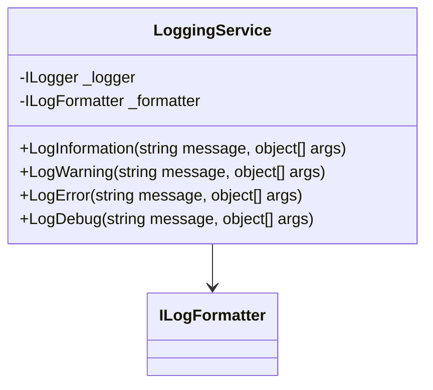

# ログ出力の統一化実装計画

## 目的

全てのログメッセージに時刻を表示し、一貫性のあるログ出力を実現する

## 現状の課題

1. ErrorHandler クラスのみが時刻表示を実装
2. 他のサービス（DataverseClient, CsvExporter）は直接 ILogger を使用
3. ログフォーマットが統一されていない

## 実装アプローチ

### 1. ログフォーマッターの作成

### 2. 共通ログサービスの実装

### 3. 既存サービスの修正

1. ErrorHandler の機能を LoggingService に統合
2. 各サービスで LoggingService を使用するように修正
   - DataverseClient
   - CsvExporter

## 実装手順

1. ILogFormatter インターフェースと TimestampLogFormatter クラスの作成
2. LoggingService クラスの実装
3. 既存の ErrorHandler クラスの機能を LoggingService に移行
4. DataverseClient と CsvExporter を LoggingService を使用するように修正
5. Program.cs での DI 設定の更新

## 期待される結果

- すべてのログメッセージに統一された時刻表示
- 一貫性のあるログフォーマット
- メンテナンス性の向上
