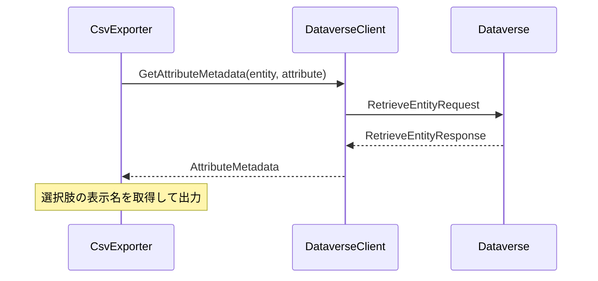

# 選択肢データ型の表示名出力機能の実装計画

## 1. 現状の課題

- 選択肢（OptionSetValue）の値が数値のまま出力されており、ユーザーにとって理解しにくい
- 選択肢の表示名を取得する機能は実装されていない

## 2. 実装方針

### 2.1 変更点

1. DataverseClient クラスの拡張

   - GetAttributeMetadata メソッドを拡張して、選択肢の表示名を取得できるようにする
   - 選択肢の表示名もキャッシュして再利用できるようにする

2. CsvExporter クラスの修正
   - FormatAttributeValue メソッド内で、OptionSetValue の処理を変更
   - 選択肢の表示名を取得して出力するように修正

### 2.2 エラー処理

- メタデータの取得に失敗した場合は、従来通り数値を出力
- 対応する表示名が見つからない場合も、数値を出力
- エラーをログに記録して、処理を継続

## 3. パフォーマンスへの影響

- メタデータはキャッシュされるため、初回のみ Dataverse へのアクセスが発生
- 2 回目以降はキャッシュを利用するため、パフォーマンスへの影響は最小限

## 4. テスト計画

1. 選択肢を含むエンティティでの動作確認
2. キャッシュの動作確認
3. エラーケースの確認
   - メタデータ取得失敗
   - 対応する表示名なし
4. 大量データでのパフォーマンス確認
