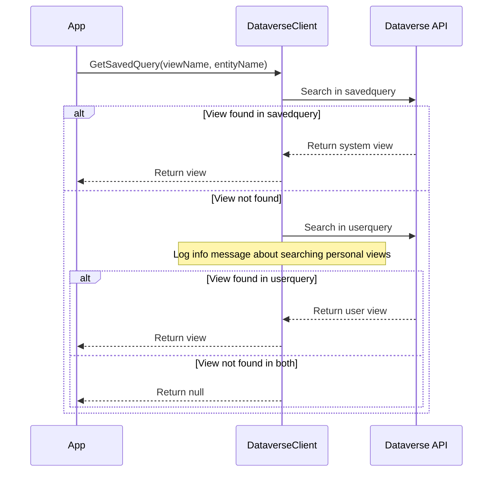

# 個人ビューサポート実装計画

## 1. 変更概要

DataverseClient クラスを修正し、ビューの検索を以下の順序で行うように変更します：

1. システムビュー（savedquery）を検索
2. 見つからない場合は個人ビュー（userquery）を検索
3. 適切なログメッセージを出力

## 2. 設計図

## 3. コード変更点

1. GetSavedQuery メソッドの修正
   - システムビューの検索ロジックを別メソッドに抽出
   - 個人ビューの検索ロジックを新規作成
   - メインメソッドで両方を順次検索
   - 適切なログメッセージを追加

## 4. エラーハンドリング

- システムビューが見つからない場合のログメッセージを追加
- 個人ビューも見つからない場合は既存の挙動を維持（ArgumentException）

## 5. テスト項目

1. システムビューが存在する場合の動作確認
2. システムビューが存在せず、個人ビューが存在する場合の動作確認
3. 両方のビューが存在しない場合の動作確認
